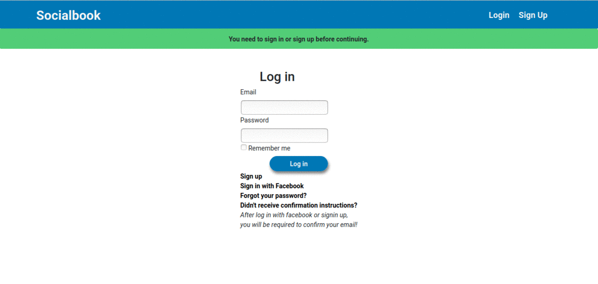

# Project: Fakebook ([Microverse - The Odin Project](https://www.theodinproject.com/courses/ruby-on-rails/lessons/final-project))

> SocialBook page made with Ruby on Rails framework. Deployed on Heroku. 

Project taken from [Microverse](https://www.microverse.org/) Curriculum and [The Odin Page](httpThe objective of this project is build a social networking using Facebook's core logic.s://www.theodinproject.com/courses/ruby-on-rails/lessons/final-project).. A social network built using Ruby on Rails and Ruby

[Devise Documentation]( https://github.com/plataformatec/devise/wiThe objective of this project is build a social networking using Facebook's core logic.ki.)

- The objective of this project is build a social network using Facebook's core logic

### Desktop view

Javascript with Webpack project from [The Odin Project curriculum](https://www.theodinproject.com/courses/javascript/lessons/todo-list)

## Built With:

- Ruby
- Ruby on Rails
- Heroku

## Live Demo

 [Live view - SocialBook Page](https://socialbook2019.herokuapp.com)
 
## Future features
 The objective of this project is build a social networking using Facebook's core logic.
- Login with Social Media Authentication
- Friendly UI.
- Filter Stories.
 
## Getting Started

 Principal Functions:
  - Create account using email address.
  - Login with your Facebook account.
  - Send friend Requests.
  - View posts from friends  of friends.

#### [Entity Relation Diagram](https://github.com/MephistoDevelop/fakebook/blob/master/docs/Fakebook-ERM.png)

#### Language Requirements

    Ruby 2.6.3
    Rails 5.2.0

#### GEMS

- Postgre
- Bootstrap
- Devise
- Omniauth-facebook
- Figaro
- Factory-Bot
- Capybara

### Setup
To use this project you will need to download this repository to your computer, Then you will need to install webpack and npm to correctly run this project.

#### Installation

Clone or download the repository to your local machine. Then open your terminal on the repository folder and run:

    bundle install

    rails db:create

    rails db:migrate

    rails db:seed
    
    
#### Database Requirements

The project runs on PostgreSQL.

To run this application you must have a default PSQL role WITH LOGIN CREATED  and then run or create a PSQL role run the following commands in the Postgres console

      For Creating a User:
      postgres=# CREATE ROLE role_name WITH LOGIN CREATEDB;

      For Altering Existing User
      postgres=# ALTER ROLE "role_name" WITH LOGIN CREATEDB;
      

### Deployment

Run:

    rails server

    enter to your:   http://localhost:3000/

### Rspec tests

    To run rspec on the terminal:

      rspec

## Authors

👤 **Cristian Ines Hernandez A. - MephistoDevelop**

- Github: [@MephistoDevelop](https://github.com/MephistoDevelop)
- Twitter: [@MephistoDevelop](https://twitter.com/MephistoDevelop)
- Linkedin: [Cristian Hernandez](https://www.linkedin.com/in/cristian-hernandez1992/)

👤 **Sergio Diaz**

[Github](https://github.com/serdg0) | [Twitter](https://twitter.com/thesergiod) | [Linkedin](https://www.linkedin.com/in/sergiodiaz-dev/) | [Portfolio](https://sergiodev.netlify.com/)

## 🤝 Contributing

Contributions, issues, and feature requests are welcome!

Feel free to check the [issues page](issues/).

## Show your support

Give and ⭐️ if you like this project!

## 📝 License

This project is [MIT](lic.url) licensed.
